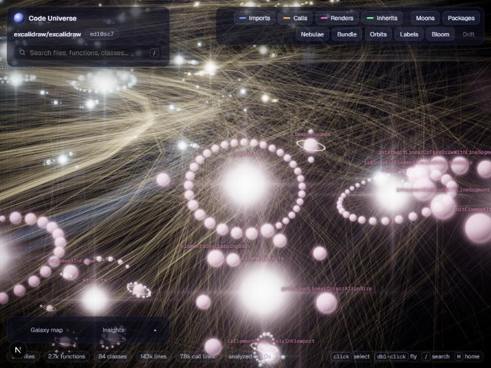
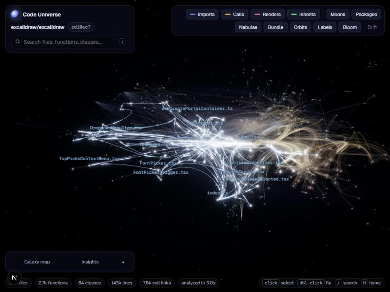

# Code Universe

**Fly through any GitHub repository as a living 3D galaxy.** Paste a repo URL; Code Universe parses every
JavaScript/TypeScript file with the TypeScript Compiler API, resolves who calls whom with the type checker,
lays the result out with a Barnes–Hut force simulation, and renders it as a star map — files are stars,
functions orbit them as planets, class methods are moons, and calls stream between them as light.


> **한국어 요약** — GitHub 레포 URL을 넣으면 TypeScript Compiler API로 AST를 파싱하고 **타입 체커로 실제 호출 대상을
> resolve**(re-export 배럴, alias, tsconfig `paths`, 모노레포 workspace 패키지, CommonJS까지)한 뒤, 직접 구현한
> **Barnes–Hut 옥트리 3D force-directed 레이아웃**(Web Worker)으로 배치하고, 커스텀 셰이더로 은하수처럼 렌더링하는
> 개발자 도구입니다. 파일 = 항성, 함수 = 공전하는 행성(케플러 법칙 속도), 메서드 = 위성, 엣지는
> **계층적 엣지 번들링(HEB)** 으로 GPU에서 큐빅 베지어로 그립니다. 순환 의존성(Tarjan SCC), 가장 많이 호출되는
> 함수, 아무도 참조하지 않는 "암흑 물질"(dead code 후보)을 찾아주고, 두 함수 사이의 **최단 호출 경로**를
> 추적해 혜성처럼 보여줍니다.

| | |
|---|---|
|  |  |
| **Up close:** `bounds.ts` and its planets, the ringed class `ElementBounds`, ambient labels | **Insights:** spotlighting a 101-file runtime import cycle in excalidraw |

## Features

- **Any public repo, any subdirectory** — `owner/repo`, full URLs, `…/tree/<branch>/<sub/dir>` (great for monorepos).
- **Semantic call graph**, not regex: calls, `new`, JSX renders, `extends`/`implements`, followed through
  aliases, barrels, renamed re-exports, `const a = b` chains, destructuring and CommonJS `require`/`exports`.
- **Galaxy layout**: directories form regions of a flattened disk; dependencies pull related systems together;
  external npm packages and Node builtins sit on an outer ring.
- **Exploration**: click to highlight a body's neighbourhood, double-click to fly there (the camera follows
  orbiting planets), search (`/`), history (`Backspace`), home (`H`), shareable deep links (`?focus=src/a.ts#fn`),
  every body links to its exact lines on GitHub.
- **Trace paths**: pick two bodies and get the shortest chain between them — calls/renders/extends first,
  then file imports, then the reverse direction — listed hop by hop and animated as a comet running along
  the bundled curves. Shareable as `?from=src/a.ts#fn&to=src/b.ts#other`.
- **Insights**: import cycles (type-only imports excluded), "supermassive" most-called functions,
  dark matter (unreferenced non-exported functions), most-imported files, largest files, top packages.
- **Filters**: edge kinds, moons, packages, nebulae, region hide/solo, edge bundling, orbit animation, bloom.

## How a repository becomes a galaxy

```
GitHub ──► stream & untar ──► virtual FS ──► parse (AST) ──► link (TypeChecker) ──► graph JSON (NDJSON stream)
                                                                                         │
            screen-space picking ◄── instanced shaders ◄── orbits ◄── Barnes–Hut sim (Web Worker)
```

### 1. Fetch — `lib/analyzer/github.ts`, `lib/analyzer/tar.ts`
Whole repos are streamed from `codeload.github.com`, gunzipped and untarred **in memory by a hand-written
streaming tar parser** (ustar + pax global/local headers + GNU long names, validated checksums). Only files that
pass the source filter are ever buffered, so a 200 MB archive costs a few MB of RAM. The commit sha comes from
the archive redirect or the pax `comment` header — no REST quota spent.
A tarball can't be cut by directory, so for subdirectory URLs **one** Git Trees API call lists the repo and a
cost model picks the cheaper path: stream the whole archive, or fetch only the selected sources from
`raw.githubusercontent.com` with 32 parallel workers (the only option when assets push the archive past the size
limit — three.js `src` drops from >250 MB of archive to 1.5 s of file fetches).

### 2. Parse & declare — `lib/analyzer/build.ts` (phase A)
Every file becomes a `ts.SourceFile`. Declarations become bodies: functions, arrow functions (also through HOC
wrappers like `memo(forwardRef(…))`), classes and members, namespace members, object-literal "service" functions,
and CommonJS shapes (`module.exports = …`, `exports.x = …`, `Foo.prototype.bar = …`, `res.status = function…`).

### 3. Link — the type checker does the hard part (phase B)
All files go into one `ts.Program` over a **virtual file system** (`lib/analyzer/resolver.ts`) with:
- per-directory `tsconfig.json`/`jsconfig.json` discovery (each monorepo package keeps its own `paths`),
- **workspace package resolution** — `import { x } from '@scope/pkg'` maps to that package's *source* entry
  (`dist/index.js` → `src/index.ts` heuristics, `exports` maps, subpaths),
- `@/…` / `~/…` root aliases when no `paths` exist.

For each call site the callee's symbol is resolved and then **followed** until it lands on a registered
declaration: aliases (`getAliasedSymbol`) → shorthand properties → `const a = b` / `= obj.prop` chains →
JS assignment declarations → and finally the *type's* symbol for destructured bindings. Method calls on typed
receivers (`shape.area()`, `this.render()`) resolve through the checker's property lookup.
A wall-clock budget (`SEMANTIC_BUDGET_MS`, default 25 s) degrades gracefully: after it, only lookups that don't
force expression type inference are performed (identifiers, namespace imports, `this.x`, static members).

Finally: Tarjan's SCC (iterative) finds runtime import cycles, directories are aggregated, and files are grouped
into regions (workspace packages, or top-level dirs below an auto-detected source root like `src/`).
Progress streams to the browser as NDJSON; results are cached in-process by commit sha.

### 4. Layout — `lib/layout/*` (Web Worker)
Only directories, files and packages are simulated (~2k bodies for React); planets are placed analytically.
- **Barnes–Hut octree** in flat typed arrays (no per-tick allocation) for O(n log n) repulsion — verified within
  5 % of the exact O(n²) forces in tests — and the same octree, pruned by max radius, for **collisions** between
  whole star systems.
- d3-style degree-biased springs for the directory tree and for dependencies lifted to file level
  (import weight + call weight), weak central gravity, disk flattening, and an outer package ring that tracks
  the galaxy's live 90th-percentile radius.
- Initial positions are a weighted radial tree, so the "big bang" converges in ~320 ticks.

### 5. Orbits & rendering — `lib/viz/*`, `components/universe/*`
- Planets are **packed into concentric rings** around their star (ring capacity by arc length, classes reserve
  room for their moons), each system in its own tilted plane, moving at **Kepler speeds** (ω ∝ r^-1.5).
- One instanced draw call for all bodies: a camera-facing quad whose fragment shader draws a star (core, halo,
  diffraction spikes that fade up close), lit planet, ringed planet, moon, beacon or nebula.
- **Hierarchical edge bundling**: each edge is a cubic Bézier whose control points lean toward the two
  ancestors just below its endpoints' lowest common ancestor directory — cross-region traffic flows in
  corridors instead of a hairball. Curves are evaluated **on the GPU** from 12 floats per edge per frame;
  pulses travel from caller to callee.
- Additive blending saturates quickly, so opacity is normalised by how many edges are visible / emphasised.
- **Screen-space picking** (project every body, nearest within its on-screen radius) instead of raycasting
  tiny moving billboards; DOM labels with collision avoidance, including "ambient" labels for whatever is
  large on screen.

## Measured

Analyzer (`npm run analyze`, cold, this machine):

| Repository | Files | Functions + methods | Call/render edges | Total |
|---|---:|---:|---:|---:|
| pmndrs/zustand | 15 | 31 | 20 | 0.9 s |
| expressjs/express (CommonJS) | 7 | 61 | 25 | 0.5 s |
| excalidraw/excalidraw | 508 | 2.7k | 7.8k | 4.1 s |
| facebook/react | 1,594 | 7.0k | 11.5k | 3.4 s |
| vercel/next.js › packages/next/src | 1,278 | 4.5k | 7.7k | 8.5 s |
| mrdoob/three.js › src (per-file mode) | 755 | 4.4k | 6.4k | 2.9 s |

Parse + type-checked linking is 1.3–2.5 s even for the largest of these; the rest is network.

Layout (`npm run bench:layout`) and rendering:

| Graph | Bodies simulated | Layout | Overlapping systems | Per-frame CPU |
|---|---:|---:|---:|---:|
| excalidraw (3.2k nodes, 9.1k edges) | 638 | 0.38 s | 0 | — |
| three.js src (5.7k nodes, 9.9k edges) | 815 | 0.44 s | 0 | — |
| react (9.2k nodes, 17k edges) | 2,045 | 1.3 s | 0 | ~0.7 ms |

## Running it

```bash
npm install
npm run dev          # http://localhost:3000
npm test             # analyzer, path finder, tar parser, octree/simulation, Tarjan — node:test via tsx
npm run analyze -- pmndrs/zustand --out tmp/zustand.json   # CLI analyzer
npm run bench:layout -- tmp/zustand.json
```

Environment (all optional):

| Variable | Purpose |
|---|---|
| `GITHUB_TOKEN` | Private repos and a higher API limit for the tree-mode fallback |
| `SEMANTIC_BUDGET_MS` | Type-checker time budget before degrading to fast lookups (default 25000) |

Deploys as a standard Next.js app (the analyzer route runs on the Node.js runtime with `maxDuration = 60`;
`typescript` is a server external package).

## Project layout

```
app/                     Next.js routes: landing, /u/[owner]/[repo] viewer, /api/analyze (NDJSON stream)
lib/analyzer/            github fetch, streaming tar, filters, virtual FS + resolver, AST→graph, cycles
lib/layout/              octree, force simulation, worker + main-thread fallback
lib/viz/                 client model (orbits, sim input, bundling anchors), path finder, emphasis, runtime
components/universe/     R3F scene: bodies, edges, galaxy dust, camera rig, picking
components/hud/          search, toolbar, galaxy map & insights, node & path panels, labels, deep links
scripts/                 analyze CLI, layout benchmark
tests/                   node:test suites
```

## Limitations

- JavaScript/TypeScript only (no Vue/Svelte SFCs); Flow-typed JS is parsed leniently.
- Calls through interfaces or dynamic dispatch resolve to the declared member, not every implementation.
- "Dark matter" is a heuristic: framework entry points and reflection can make used code look unused.
- Repos above 2,500 source files are truncated (core-looking files kept first); analyze a subdirectory instead.

## Stack

Next.js 16 · React 19 · Three.js / React Three Fiber / drei / postprocessing · TypeScript 6 Compiler API ·
zustand · Web Workers · node:test
